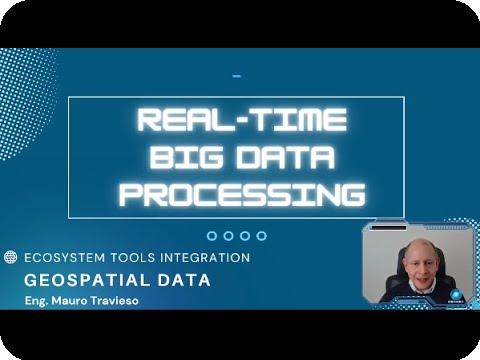
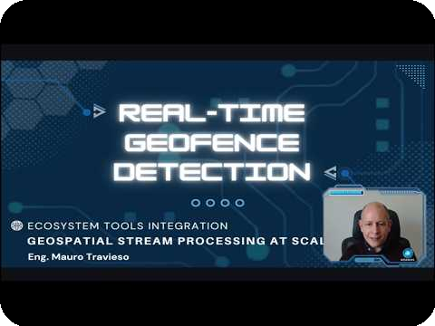
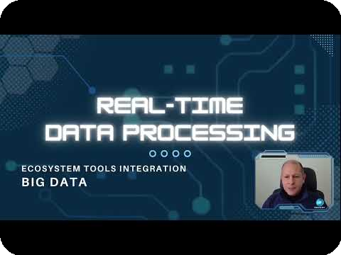
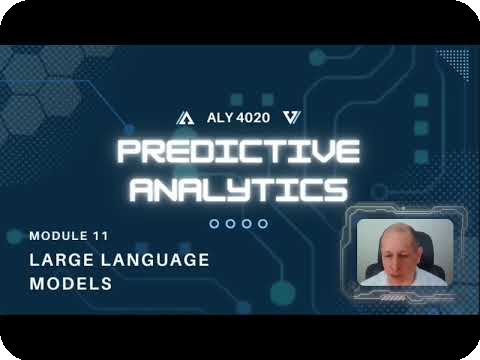
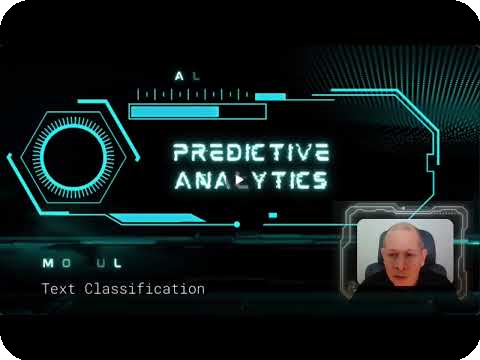
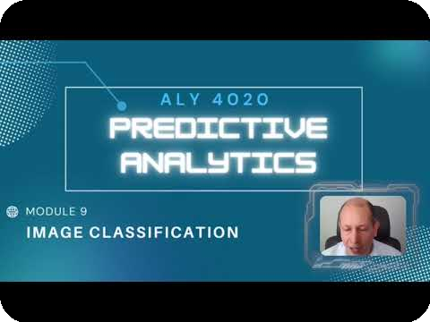
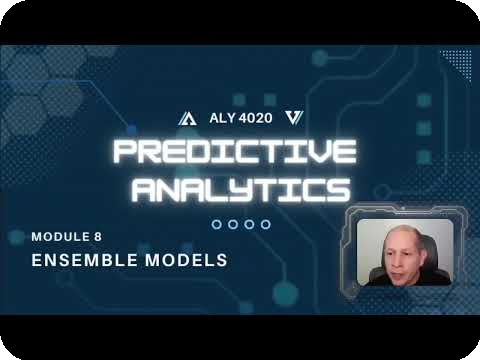
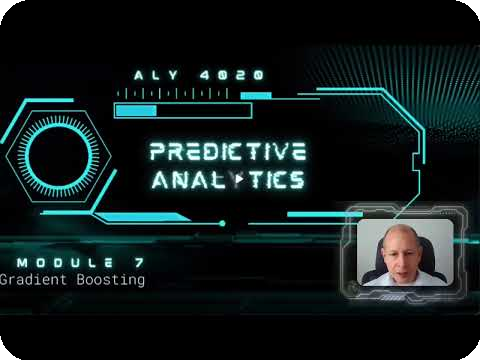

# Mauro Travieso
### `Big Data Engineer · Machine Learning Engineer`
 

 

---
 
Big Data Engineer professional and researcher with experience in software application development across the Data Engineering and Machine Learning fields. Proficient in Big Data ecosystem tools for ETL/ELT pipeline development and analytics, mathematical algorithms, theoretical modeling, and adaptive programming.
 
---

#### ⚡ Latest Projects! 

 

#### **`GeoSpatial Big Data | Real-time`** 
  * Orchestrating,
  * Capturing,
  * Processing,
  * Querying,
  * Distributed Persisting,
  * Dashboarding,
  * and Governing

 

#### 🕸️ *Geofence Detection & Ping-POIs Enrichment*
<!-- <h4 align="center">🕸️ <i>Geofence Detection & Ping-POIs Enrichment</i></h4> -->

##### * Active Pings-POIs | Calculation & Interaction + Geofencing | Dasboarding & API calls

  
  

  <em>Pings-POIs | Calculation & Interaction          </em> &nbsp;&nbsp;&nbsp;&nbsp;&nbsp;&nbsp;&nbsp;&nbsp;&nbsp;&nbsp;&nbsp;&nbsp;&nbsp;&nbsp;&nbsp;&nbsp;&nbsp; <em>          Geofencing | Dasboarding & API calls</em>

 

---
#### 🛰️ *Satellite Trajectory Classification System*

##### * Live Equirectangular projections & Active Satellites' LEO
  
<!---  --->
<!--

  

 
-->

  
  

  <em>Equirectangular projections          </em> &nbsp;&nbsp;&nbsp;&nbsp;&nbsp;&nbsp;&nbsp;&nbsp;&nbsp;&nbsp;&nbsp;&nbsp;&nbsp;&nbsp;&nbsp;&nbsp;&nbsp; <em>          Satellites' LEO</em>

<!--
* Active Satellites' LEO

 
-->

 

* Satellite classification App in Production
<!--

-->

  

---

#### 🚤 🚁 🚢 *Vehicle Tracking ML System - Production Deployment* 🚗 🚚 🏍️

##### * Real-time Transportation Data interaction & Current Transportation App in Production | Geocoding & Reverse geocoding
<!--

 

* Current Transportation App in Production

 
-->

  
  

  <em>Real-time Transportation Data interaction</em> &nbsp;&nbsp;&nbsp;&nbsp;&nbsp;&nbsp;&nbsp;&nbsp;&nbsp;&nbsp;&nbsp;&nbsp;&nbsp;&nbsp;&nbsp;&nbsp;&nbsp; <em>Transportation App in Production</em>

---

#### ✅ For more, click on to watch:

---
 
## 🎬 Watch the Projects
 
### GeoSpatial Projects Overview · 3 min
 

  
  &nbsp;&nbsp;
  
    
  <b>Real-Time GeoSpatial Big Data</b>
   
  Processing and Governing &nbsp;&nbsp;&nbsp;&nbsp;&nbsp;&nbsp;&nbsp;&nbsp;&nbsp;&nbsp;&nbsp;&nbsp;&nbsp;&nbsp;&nbsp;&nbsp;&nbsp;&nbsp;&nbsp;&nbsp;⬢&nbsp;&nbsp;&nbsp;&nbsp;&nbsp;&nbsp;&nbsp;&nbsp;&nbsp;&nbsp;&nbsp;&nbsp;&nbsp;&nbsp;&nbsp;&nbsp;&nbsp;&nbsp;&nbsp;&nbsp; Geofencing and Optimization

 
### Detailed GeoSpatial Project Development
 

  

---
 
## 📚 You Might Also Enjoy
 

  <table>
    <tr>
      <td align="center" width="340">
        <b>Large Language Models</b> 
        Foundations and Architectures  
        
      </td>
      <td align="center" width="340">
        <b>Large Language Models</b> 
        Advanced Applications  
        
      </td>
    </tr>
    <tr>
      <td align="center">
        <b>Text Classification</b> 
        NLP and Predictive Analytics  
        
      </td>
      <td align="center">
        <b>Image Classification</b> 
        Computer Vision Fundamentals  
        
      </td>
    </tr>
    <tr>
      <td align="center">
        <b>Ensemble Models</b> 
        Bagging and Boosting Logic  
        
      </td>
      <td align="center">
        <b>Gradient Boosting & XGBoost</b> 
        High-Performance ML Models  
        
      </td>
    </tr>
  </table>

---
 
## 🛠️ Tech Stack
 
### Languages
 

 
### Big Data & Cloud Ecosystem
 

 
### Cloud Platforms
 

 
### Infrastructure & OS
 

 
### IDEs & Notebooks
 

 
---
 
## 📊 GitHub Stats
 

 

&nbsp;

 

 
